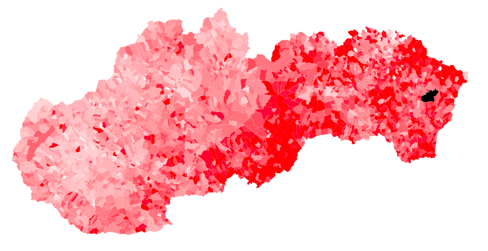

# TopoJSON file for Slovakia

Multiple administration levels:
  * regions
  * districts
  * municipalities

Every entry has a name and a NUTS identifier.

See [example.html](example.html) for additional info.

Sources:
  * [http://www.sodbtn.sk](http://www.sodbtn.sk)
  * [http://wiki.freemap.sk/HraniceAdministrativnychUzemi](http://wiki.freemap.sk/HraniceAdministrativnychUzemi)
  * [NUTS 2004](http://slovak.statistics.sk/wps/portal/ext/metadata/classifications/!ut/p/b1/jY_dcoIwEEafxQfQbAxIuEwYxwRB-R2BG4diqrYglIqoT1_a6UVvart3O3POfvuhDCUoO-WX4z4_H-tTXn7u2WzrG5JyjhmAu7RAEil8zgIMTB-AdACsBROa4QBQZ6GDZCIOTJ8QYOR_PvwyDP7ybZQdn6pJX1QTmNApGSSCNc0wiYEJ2qDs4QGpfQOPCnwBDz5cibpSQ1SaGT-ChMVBBjMvXnoRATJFm1a9111bKOQXeXFQjrqo0sv3CoUoAW0bvtBWRhZeOvN2_eYFLqQU3Ht6ddso5n19spvdq94Vuj5-ruwu5fbOjsL7dW-VEIZXaVKzvxXY5tZ5zXbzQ-nnzbgRq74Ss-6QzDu2bjEINkJNFSe3UI5p748-AG5qQ5c!/)
